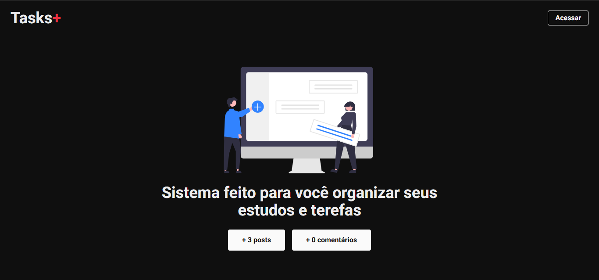

# 🚀 Tasks+

Aplicação web para **organização de tarefas e interação entre usuários**, desenvolvida com Next.js, TypeScript e Firebase.

## 📸 Preview



🔗 **Demo:** https://more-tasks-two.vercel.app/

## ✨ Funcionalidades

* 🔐 Autenticação de usuários
* 📝 Criação e gerenciamento de tarefas
* 🌎 Publicação de tarefas
* 💬 Comentários
* 🔄 Atualização de dados em tempo real
* 📱 Interface responsiva

## 🛠️ Tecnologias

* Next.js
* React
* TypeScript
* Tailwind CSS
* Firebase / Firestore
* NextAuth
* React Icons
* Vercel

## 📚 O que pratiquei

Durante o desenvolvimento, trabalhei com:

* Next.js App Router
* Componentização com React
* TypeScript
* Autenticação
* CRUD com Firestore
* Dados em tempo real
* Rotas dinâmicas
* Deploy na Vercel

## ⚙️ Como executar

```bash
git clone SEU_REPOSITORIO
cd moreTasks
npm install
npm run dev
```

Depois, acesse:

```text
http://localhost:3000
```

> É necessário configurar as variáveis de ambiente do Firebase e da autenticação.

## 👨‍💻 Desenvolvedor

**José Kaynan Teixeira de Lima**

Front-End Developer | UI/UX Designer

* 💼 [LinkedIn](https://www.linkedin.com/in/kaynan-teixeira/)
* 🐙 [GitHub](https://github.com/kaynanldev-f)
